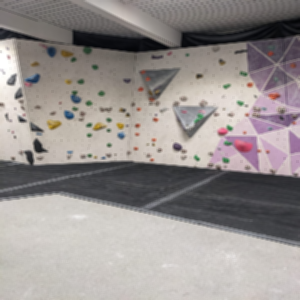
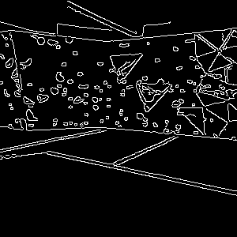
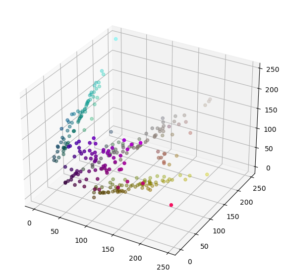

findHolds

# detectColor.py:
If run as main, 

# findColours.ipynb

Image process:   
   
- blur image to lose unimportant details   
   
- find contours on canny'd images   
   
- for every contour, store [avgColor, contourMask]    
    - avgColor : within contour
    - contourMask : Image of only the hold coloured in   
   

- use k-mean clustering to find no. different colours of holds   
    -  showColours() can produce an image with all the squares of colours   
   
   

Currently, it picks out some colours. .. just not very good colours   

==================

labelsFiltered -> one label's colour, with rest 0's   
masksFiltered -> use above list to make list only containing active colours' masks   
